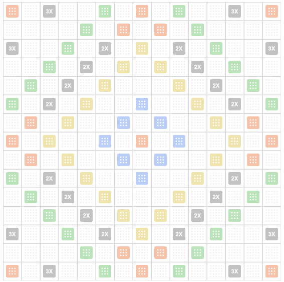

# Literaki

A small set of Python scripts for working with the Polish variant of Scrabble known as **Literaki**.  
The code can generate the game board, define tile distributions and demonstrate simple rack operations.



## Features

* **Board generation** (`board.py`)
  * `create_literaki_board()` builds a 15x15 board with word multipliers and color bonuses.
  * `print_literaki_board()` prints a readable representation to the console.
* **Tile bag utilities** (`tiles.py`)
  * `create_tile_bag()` prepares the full set of tiles with point values and counts.
  * `PlayerRack` class manages drawing and removing tiles.
* `board_layout.txt` shows the raw layout used by the board generator.

## Getting Started

These scripts only rely on the Python standard library. With Python 3 installed you can run:

```bash
python board.py     # display the board and example square info
python tiles.py     # demo of tile bag and player rack usage
```

Both scripts print example output to the terminal demonstrating the structures they create.

## Repository Contents

- `board.py` – logic for constructing and printing the Literaki board
- `tiles.py` – tile definitions and simple rack implementation
- `board_layout.txt` – text representation of board multipliers
- `board.png` – sample image of the board layout
- `chromedriver.exe` – binary left from earlier development (not required)

Feel free to adapt these utilities for your own Literaki experiments or projects.
